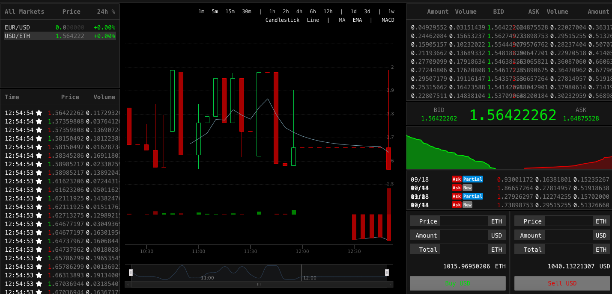

## Trading Activity Seed

This script provides the easiest way to seed your platform with some trading activity.
It requires access to Peatio database and rails console.
It's better to dump database before seeding database.

### Running

1. Copy `bin/trading_activity_seed` to `YOUR-PEATIO-DIRECTORY/bin`
You can use `cp` if you run peatio locally or `curl` if you use docker container.

2. Copy `config/trading_activity_seed.yml` to `YOUR-PEATIO-DIRECTORY/config`
You can use `cp` if you run peatio locally or `curl` if you use docker container.

3. Update seed file `vim config/trading_activity_seed.yml`

4. Make sure that your traders are created and have enough funds for orders creation.

5. Run script `RAILS_ROOT=YOUR-PEATIO-DIRECTORY bundle exec ruby bin/trading_activity_seed`

6. If you have OHLC(k-line) cached in Redis you need to clean up it and k-daemon will update it.

### Example

1. `curl https://raw.githubusercontent.com/rubykube/toolbox/661b8ad2804388e8b1aa35ed9abee7542661bf17/bin/trading_activity_seed -o bin/trading_activity_seed`

2. `curl https://raw.githubusercontent.com/rubykube/toolbox/661b8ad2804388e8b1aa35ed9abee7542661bf17/config/trading_activity_seed.yml -o config/trading_activity_seed.yml`

3. `vim config/trading_activity_seed.yml`

```yml
usdeth:
  - type:           bid
    amount:         100
    min_volume:     0.1
    max_volume:     0.2
    min_price:      0.9
    max_price:      2.0
    traders:        admin@barong.io,admin@peatio.tech
    min_created_at: Mon, 18 Sep 2018 10:00:00 CEST +02:00
    max_created_at: Mon, 18 Sep 2018 12:00:00 CEST +02:00

  - type:           ask
    amount:         50
    min_volume:     0.2
    max_volume:     0.4
    min_price:      0.8
    max_price:      2.0
    traders:        admin@barong.io,admin@peatio.tech
    min_created_at: Mon, 18 Sep 2018 10:00:00 CEST +02:00
    max_created_at: Mon, 18 Sep 2018 12:00:00 CEST +02:00
```

4. From rails console
*Never use it in production!*
```ruby
members    = 'admin@barong.io,admin@peatio.tech'.split(',').map(&:squish)
currencies = 'usd,eth'.split(',').map(&:squish)
amount     = 1000

Account.where(currency_id: currencies)\
       .joins(:member)\
       .merge(Member.where(email: members))\
       .find_each { |a| a.plus_funds!(amount) }
```

5.
```bash
RAILS_ROOT=`pwd` bundle exec ruby bin/trading_activity_seed
```

6. Clean OHLC(k-line) cached in Redis.
Regeneration of new k-line may take a lot of time first trade was created long time ago.
(about 1 hour for 4 markets and 2 month old firs trades)
```bash
KLINE_DB="redis-cli -a REDIS_PASSWORD -n 1"
$KLINE_DB KEYS "peatio:*:k:*" | xargs $KLINE_DB DEL```

### Result



